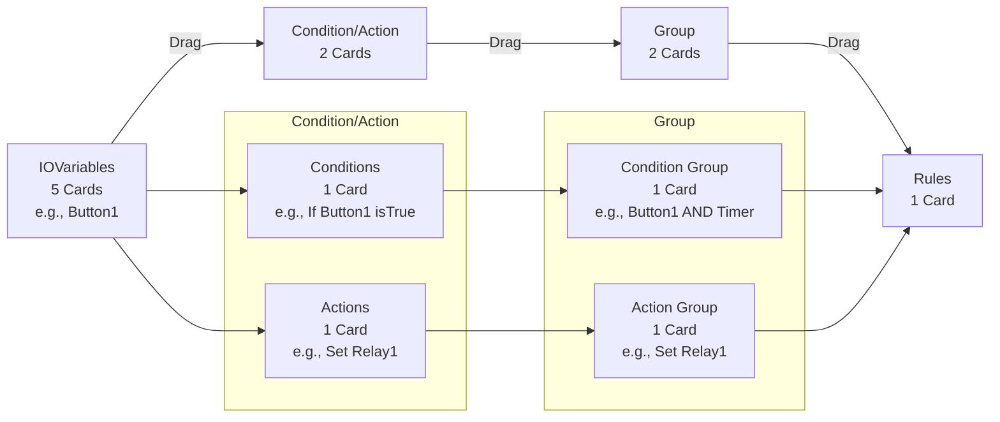

## Project Goal

The goal of the "Advanced Timer" project is to create a **self-contained, user-friendly automation system** using the ESP32 microcontroller that simplifies complex control tasks for individuals without programming expertise. By leveraging the ESP32's local server hosting capabilities, the project delivers a rudimentary **Programmable Logic Controller (PLC)** with an intuitive drop-down menu interface, eliminating the need for coding or ladder logic knowledge. It aims to bridge the gap between basic relay logic and advanced automation, enabling users to configure sophisticated logic—such as timers, input triggers, and output controls—through a standalone, accessible platform.

## Why Are We Doing This? (Purpose)

We are building this project to **democratize automation**, making it accessible to people who lack the technical skills or resources to use traditional PLCs or programming languages like C. The purpose is threefold:

1. **Empowerment**: To give non-programmers the ability to automate tasks in their homes, workshops, or small-scale industrial settings without relying on expensive, complex systems or external experts.
2. **Simplicity**: To replace the steep learning curve of ladder logic or coding with a familiar, relay-logic-inspired approach enhanced by an easy-to-use interface, reducing barriers to entry.
3. **Independence**: To provide a fully embedded solution that requires no internet, external software, or vendor-specific tools, ensuring users have full control and flexibility without lock-in or ongoing costs.

The name "Advanced Timer" reflects this purpose—it starts with the familiar concept of a timer (a staple in relay logic) and extends it into a broader, more capable system, essentially a PLC reimagined for beginners.

## For Whom Are We Doing This? (Target Audience)

We are designing this system for **non-programmers who rely on relay logic and simple timer modules** for their automation needs. This includes:

- **Hobbyists**: Individuals tinkering with DIY projects (e.g., home automation, garden watering systems) who use relays, switches, and timers but want more control without learning to code.
- **Small-Scale Industrial Users**: Operators or technicians in workshops or small factories who manage basic automation (e.g., conveyor belts, pumps) using physical relays and lack access to professional PLCs.
- **Educators and Students**: Teachers or learners in technical education settings who need an accessible entry point to automation concepts without diving into programming or complex hardware.
- **Relay-Logic Enthusiasts**: People comfortable with wiring relays and timers but seeking a step up in functionality (e.g., combining multiple timers, conditional logic) without abandoning their intuitive, hands-on approach.

These users typically lack the time, training, or inclination to master C, ladder logic, or industrial PLC programming, yet they need a practical, affordable way to automate tasks beyond what basic relay circuits can achieve.

## UI Control Flow

The "Advanced Timer" interface uses a drag-and-drop system organized into four columns: `IOVariables`, `Condition/Action`, `Group`, and `Rules`. Each column is subdivided into cards, limiting the number of items users can configure at once for simplicity and clarity. Below is the structure and workflow for creating automation logic.

### Column Structure

Each column contains a fixed number of cards, representing slots where users can define or group elements:

| **Column**         | **Number of Cards** | **Purpose**                                                                 |
|---------------------|---------------------|-----------------------------------------------------------------------------|
| `IOVariables`      | 5                   | Define up to 5 global variables (e.g., inputs, outputs, timers).           |
| `Condition/Action` | 2 (1 Conditions, 1 Actions) | Create 1 condition and 1 action at a time for dragged IOVariables. |
| `Group`            | 2 (1 Condition Group, 1 Action Group) | Group 1 set of conditions and 1 set of actions.          |
| `Rules`            | 1                   | Combine 1 condition group and 1 action group into a rule.                  |

- **`IOVariables`**: Users configure variables (e.g., "Button1" as `DigitalInput`) in one of the 5 cards. Each card is draggable to the next column.
- **`Condition/Action`**: Split into two cards:
  - **Conditions Card**: Drag an `IOVariable` here to define a condition (e.g., "If Button1 state isTrue").
  - **Actions Card**: Drag an `IOVariable` here to define an action (e.g., "Set Relay1 state").
- **`Group`**: Split into two cards:
  - **Condition Group Card**: Drag conditions here and select `andLogic` or `orLogic`.
  - **Action Group Card**: Drag actions here for sequential execution.
- **`Rules`**: One card where users drag a condition group and an action group to form a rule, reorderable within a list.

### Logic Creation Workflow

Users build logic by dragging cards across columns, following this flow:

1. **Configure IOVariables**: Add or edit variables in the 5 `IOVariables` cards.
2. **Create Conditions/Actions**: Drag an `IOVariable` to the Conditions or Actions card to define logic elements.
3. **Form Groups**: Drag conditions to the Condition Group card and actions to the Action Group card.
4. **Define Rules**: Drag a condition group and action group to the Rules card, then reorder rules as needed.

### Flowchart

The following Mermaid flowchart illustrates the drag-and-drop process:



---


- **Steps**:
  1. **Start**: User configures an `IOVariable` (e.g., "Button1" in Card 1).
  2. **Condition/Action**: Drags "Button1" to Conditions card → "If Button1 state isTrue".
  3. **Group**: Drags condition to Condition Group card, adds another (e.g., "Timer1 flagIsTrue") → "Button1 AND Timer1".
  4. **Rules**: Drags Condition Group and an Action Group (e.g., "Set Relay1") to Rules card → "Rule 1".
  5. **Reorder**: Adjusts rule order by dragging within the Rules column.

### Notes
- **Card Limits**: Fixed card counts (5, 2, 2, 1) ensure simplicity but may restrict complex setups. Users can reuse cards by editing existing items.
- **UI Controls**: Each card includes edit/remove buttons for flexibility.
- **Responsive Design**: Columns stack vertically on small screens, with cards as collapsible sections.


## Configuration Management: Unified JSON Approach

This project utilizes a **Unified JSON Approach** for managing configuration data transfer between the web-based configuration portal (front-end) and the ESP32 microcontroller (backend).

### Rationale

While a RESTful approach with multiple endpoints for each data type (`IOVariable`, `condition`, `rule`, etc.) is possible, the Unified JSON approach was chosen for several key advantages in this embedded context:

1.  **Atomic Updates & Consistency:** Configuration items often have interdependencies (rules rely on groups, which rely on conditions/actions). Sending the *entire* configuration in one transaction ensures that the device state remains consistent and avoids partial updates that could lead to undefined behavior.
2.  **Simplified Development:**
    *   **Front-end:** Requires only one API call to fetch the complete configuration and one call to save all changes. State management becomes simpler.
    *   **Backend:** Requires only one primary API endpoint (e.g., `/api/config`) to handle both sending and receiving the configuration, reducing code complexity and request handling overhead on the ESP32.
3.  **User Workflow Alignment:** Users typically load the configuration page, make multiple modifications across different sections (IOs, rules, etc.), and then save everything at once. This approach mirrors that workflow directly.
4.  **Reduced Request Overhead:** Minimizes the number of simultaneous HTTP requests the ESP32 needs to handle, which is beneficial for resource-constrained devices.

### Mechanism

*   **Endpoint:** A single primary endpoint, typically `/api/config`, is used.
*   **`GET /api/config`:**
    *   The front-end sends a GET request to this endpoint upon loading the configuration page.
    *   The ESP32 backend gathers all *active* configuration data (items where `status == true` from `IOVariable`, `condition`, `action`, `conditionGroup`, `actionGroup`, `rule` arrays) and the `ruleSequence`.
    *   It serializes this data into a single, structured JSON object.
    *   This JSON object is sent back to the front-end.
    *   *Conceptual JSON Structure:*
        ```json
        {
          "ioVariables": [ /* Array of active IOVariable objects */ ],
          "conditions": [ /* Array of active condition objects */ ],
          "actions": [ /* Array of active action objects */ ],
          "conditionGroups": [ /* Array of active conditionGroup objects */ ],
          "actionGroups": [ /* Array of active actionGroup objects */ ],
          "rules": [ /* Array of active rule objects */ ],
          "ruleSequence": [ /* Array of rule 'num's in execution order */ ]
        }
        ```
*   **`POST /api/config` (or `PUT`)**
    *   When the user saves changes, the front-end constructs a JSON object representing the *complete desired configuration* based on its current state.
    *   This single JSON object is sent via a POST (or PUT) request to the `/api/config` endpoint.
    *   The ESP32 backend receives the JSON, parses it, and performs validation.
    *   If valid, the backend **replaces** its entire current configuration in RAM with the data received from the JSON.
    *   The updated configuration is then saved atomically to persistent storage (e.g., SPIFFS, LittleFS).

### Advanced Capabilities Enabled by this Approach

*   **Configuration Import/Export:** The unified JSON object naturally represents the entire device logic state. This makes it straightforward to implement features allowing users to:
    *   **Export:** Download the current configuration JSON as a backup file.
    *   **Import:** Upload a previously exported JSON file to restore or apply a configuration.
*   **Multiple Configuration Profiles:** The device could potentially store multiple configuration JSON files (e.g., `config_day.json`, `config_night.json`) in its filesystem. The backend could then provide an interface to load and activate a specific configuration profile based on user selection or other triggers.

### Considerations

*   **Payload Size:** For very complex configurations with many active items, the JSON payload size can become significant.
*   **Memory Usage:** Parsing and serializing large JSON objects requires sufficient RAM on the ESP32. Efficient libraries (like ArduinoJson) and careful memory allocation (e.g., using a pre-sized `StaticJsonDocument`) are essential.


## Putting It All Together

In essence, we’re doing this to empower a specific group—**non-programmers rooted in relay logic**—with a tool that feels familiar yet offers advanced capabilities. The "Advanced Timer" is for hobbyists, small-scale operators, and educators who want to automate without complexity, providing them a standalone, code-free solution that transforms their simple timer-based setups into something far more versatile. Our refinements (e.g., streamlined structs, `flag` for events, drop-down UI) ensure it’s both powerful and approachable, fulfilling the mission of making automation truly accessible.